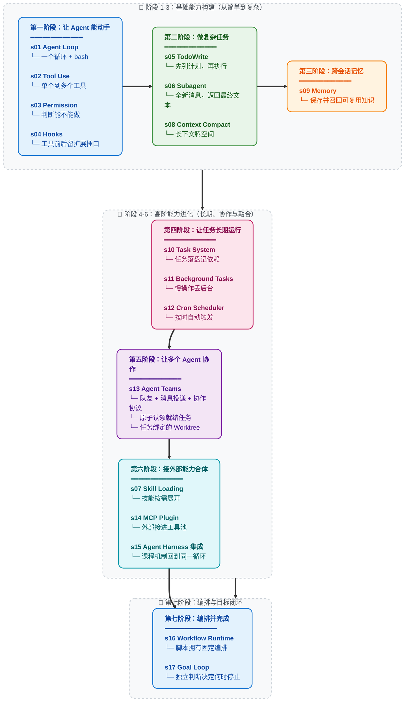

# Learn Claude Code -- 真正的 Agent Harness 工程

[English](./README.md) | [中文](./README-zh.md) | [日本語](./README-ja.md)

## Agency 来自模型，Agent 产品 = 模型 + Harness

在讨论代码之前，先把一件事说清楚。

**Agency -- 感知、推理、行动的能力 -- 来自模型训练，不是来自外部代码的编排。** 但一个能干活的 agent 产品，需要模型和 harness 缺一不可。模型是驾驶者，harness 是载具。本仓库教你造载具。

### Agency 从哪来

Agent 的核心是一个神经网络 -- Transformer、RNN、一个被训练出来的函数 -- 经过数十亿次梯度更新，在行动序列数据上学会了感知环境、推理目标、采取行动。Agency 这个东西从来不是外面那层代码赋予的，而是模型在训练中学到的。

人类就是最好的例子。一个由数百万年进化训练出来的生物神经网络，通过感官感知世界，通过大脑推理，通过身体行动。当 DeepMind、OpenAI 或 Anthropic 说 "agent" 时，他们说的核心都是同一件事：**一个通过训练学会了行动的模型，加上让它能在特定环境中工作的基础设施。**

历史已经写好了铁证：

- **2013 -- DeepMind DQN 玩 Atari。** 一个神经网络，只接收原始像素和游戏分数，学会了 7 款 Atari 2600 游戏 -- 超越所有先前算法，在其中 3 款上击败人类专家。到 2015 年，同一架构扩展到 [49 款游戏，达到职业人类测试员水平](https://www.nature.com/articles/nature14236)，论文发表在 *Nature*。没有游戏专属规则。没有决策树。一个模型，从经验中学习。那个模型就是 agent。

- **2019 -- OpenAI Five 征服 Dota 2。** 五个神经网络，在 10 个月内与自己对战了 [45,000 年的 Dota 2](https://openai.com/index/openai-five-defeats-dota-2-world-champions/)，在旧金山直播赛上 2-0 击败了 **OG** -- TI8 世界冠军。随后的公开竞技场中，AI 在 42,729 场比赛中胜率 99.4%。没有脚本化的策略。没有元编程的团队协调逻辑。模型完全通过自我对弈学会了团队协作、战术和实时适应。

- **2019 -- DeepMind AlphaStar 制霸星际争霸 II。** AlphaStar 在闭门赛中 [10-1 击败职业选手](https://deepmind.google/blog/alphastar-mastering-the-real-time-strategy-game-starcraft-ii/)，随后在欧洲服务器上达到[宗师段位](https://www.nature.com/articles/d41586-019-03298-6) -- 90,000 名玩家中的前 0.15%。一个信息不完全、实时决策、组合动作空间远超国际象棋和围棋的游戏。Agent 是什么？是模型。训练出来的。不是编出来的。

- **2019 -- 腾讯绝悟统治王者荣耀。** 腾讯 AI Lab 的 "绝悟" 于 2019 年 8 月 2 日世冠杯半决赛上[以 5v5 击败 KPL 职业选手](https://www.jiemian.com/article/3371171.html)。在 1v1 模式下，职业选手 [15 场只赢 1 场，最多坚持不到 8 分钟](https://developer.aliyun.com/article/851058)。训练强度：一天等于人类 440 年。到 2021 年，绝悟在全英雄池 BO5 上全面超越 KPL 职业选手水准。没有手工编写的英雄克制表。没有脚本化的阵容编排。一个从零开始通过自我对弈学习整个游戏的模型。

- **2024-2025 -- LLM Agent 重塑软件工程。** Claude、GPT、Gemini -- 在人类全部代码和推理上训练的大语言模型 -- 被部署为编程 agent。它们阅读代码库，编写实现，调试故障，团队协作。架构与之前每一个 agent 完全相同：一个训练好的模型，放入一个环境，给予感知和行动的工具。唯一的不同是它们学到的东西的规模和解决任务的通用性。

每一个里程碑都指向同一个事实：**Agency -- 那个感知、推理、行动的能力 -- 是训练出来的，不是编出来的。** 但每一个 agent 同时也需要一个环境才能工作：Atari 模拟器、Dota 2 客户端、星际争霸 II 引擎、IDE 和终端。模型提供智能，环境提供行动空间。两者合在一起才是一个完整的 agent。

### Agent 不是什么

"Agent" 这个词已经被一整个提示词水管工产业劫持了。

拖拽式工作流构建器。无代码 "AI Agent" 平台。提示词链编排库。它们共享同一个幻觉：把 LLM API 调用用 if-else 分支、节点图、硬编码路由逻辑串在一起就算是 "构建 Agent" 了。

不是的。它们做出来的东西是鲁布·戈德堡机械 -- 一个过度工程化的、脆弱的过程式规则流水线，LLM 被楔在里面当一个美化了的文本补全节点。那不是 Agent。那是一个有着宏大妄想的 shell 脚本。

**提示词水管工式 "Agent" 是不做模型的程序员的意淫。** 他们试图通过堆叠过程式逻辑来暴力模拟智能 -- 庞大的规则树、节点图、链式提示词瀑布流 -- 然后祈祷足够多的胶水代码能涌现出自主行为。不会的。你不可能通过工程手段编码出 agency。Agency 是学出来的，不是编出来的。

那些系统从诞生之日起就已经死了：脆弱、不可扩展、根本不具备泛化能力。它们是 GOFAI（Good Old-Fashioned AI，经典符号 AI）的现代还魂 -- 几十年前就被学界抛弃的符号规则系统，现在喷了一层 LLM 的漆又登场了。换了个包装，同一条死路。

### 心智转换：从 "开发 Agent" 到开发 Harness

当一个人说 "我在开发 Agent" 时，他只可能是两个意思之一：

**1. 训练模型。** 通过强化学习、微调、RLHF 或其他基于梯度的方法调整权重。收集任务过程数据 -- 真实领域中感知、推理、行动的实际序列 -- 用它们来塑造模型的行为。这是 DeepMind、OpenAI、腾讯 AI Lab、Anthropic 在做的事。这是最本义的 Agent 开发。

**2. 构建 Harness。** 编写代码，为模型提供一个可操作的环境。这是我们大多数人在做的事，也是本仓库的核心。

Harness 是 agent 在特定领域工作所需要的一切：

```
Harness = Tools + Knowledge + Observation + Action Interfaces + Permissions

    Tools:          文件读写、Shell、网络、数据库、浏览器
    Knowledge:      产品文档、领域资料、API 规范、风格指南
    Observation:    git diff、错误日志、浏览器状态、传感器数据
    Action:         CLI 命令、API 调用、UI 交互
    Permissions:    沙箱隔离、审批流程、信任边界
```

模型做决策。Harness 执行。模型做推理。Harness 提供上下文。模型是驾驶者。Harness 是载具。

**编程 agent 的 harness 是它的 IDE、终端和文件系统。** 农业 agent 的 harness 是传感器阵列、灌溉控制和气象数据。酒店 agent 的 harness 是预订系统、客户沟通渠道和设施管理 API。Agent -- 那个智能、那个决策者 -- 永远是模型。Harness 因领域而变。Agent 跨领域泛化。

这个仓库教你造载具。编程用的载具。但设计模式可以泛化到任何领域：庄园管理、农田运营、酒店运作、工厂制造、物流调度、医疗保健、教育培训、科学研究。只要有一个任务需要被感知、推理和执行 -- agent 就需要一个 harness。

### Harness 工程师到底在做什么

如果你在读这个仓库，你很可能是一名 harness 工程师 -- 这是一个强大的身份。以下是你真正的工作：

- **实现工具。** 给 agent 一双手。文件读写、Shell 执行、API 调用、浏览器控制、数据库查询。每个工具都是 agent 在环境中可以采取的一个行动。设计它们时要原子化、可组合、描述清晰。

- **策划知识。** 给 agent 领域专长。产品文档、架构决策记录、风格指南、合规要求。按需加载（s07），不要前置塞入。Agent 应该知道有什么可用，然后自己拉取所需。

- **管理上下文。** 子 Agent 把明确的工作留在另一份消息列表中；上下文压缩（s08）缩短较早的历史；任务系统（s10）让目标持久化到单次对话之外。

- **控制权限。** 给 agent 边界。沙箱化文件访问。对破坏性操作要求审批。在 agent 和外部系统之间实施信任边界。这是安全工程与 harness 工程的交汇点。

- **收集任务过程数据。** Agent 在你的 harness 中执行的每一条行动序列都是训练信号。真实部署中的感知-推理-行动轨迹是微调下一代 agent 模型的原材料。你的 harness 不仅服务于 agent -- 它还可以帮助进化 agent。

你不是在编写智能。你是在构建智能栖居的世界。这个世界的质量 -- agent 能看得多清楚、行动得多精准、可用知识有多丰富 -- 直接决定了智能能多有效地表达自己。

**造好 Harness。Agent 会完成剩下的。**

### 为什么是 Claude Code -- Harness 工程的大师课

为什么这个仓库专门拆解 Claude Code？

因为 Claude Code 是我们所见过的最优雅、最完整的 agent harness 实现。不是因为某个巧妙的技巧，而是因为它 *没做* 的事：它没有试图成为 agent 本身。它没有强加僵化的工作流。它没有用精心设计的决策树去替模型做判断。它给模型提供了工具、知识、上下文管理和权限边界 -- 然后让开了。

把 Claude Code 剥到本质来看：

```
Claude Code = 一个 agent loop
            + 工具 (bash, read, write, edit, glob, grep, browser...)
            + 按需 skill 加载
            + 上下文压缩
            + 子 agent 派生
            + 带依赖图的任务系统
            + 异步邮箱的团队协调
            + 任务绑定的 worktree 并行执行
            + 权限治理
            + hooks 扩展系统
            + memory 持久化
            + MCP 外部能力路由
```

就这些。这就是全部架构。每一个组件都是 harness 机制 -- 为 agent 构建的栖居世界的一部分。Agent 本身呢？是 Claude。一个模型。由 Anthropic 在人类推理和代码的全部广度上训练而成。Harness 没有让 Claude 变聪明。Claude 本来就聪明。Harness 给了 Claude 双手、双眼和一个工作空间。

这就是 Claude Code 作为教学标本的意义：**它展示了当你信任模型、把工程精力集中在 harness 上时会发生什么。** 本仓库的课程（s01-s17）逐步拆解并重组 harness 机制。学完之后，你理解的不只是一个 coding agent 怎么工作，而是适用于不同领域的 harness 工程原则。

启示不是 "复制 Claude Code"。启示是：**最好的 agent 产品，出自那些明白自己的工作是 harness 而非 intelligence 的工程师之手。**

---

## 愿景：用真正的 Agent 铺满宇宙

这不只关乎编程 agent。

每一个人类从事复杂、多步骤、需要判断力的工作的领域，都是 agent 可以运作的领域 -- 只要有对的 harness。本仓库中的模式是通用的：

```
庄园管理 agent  = 模型 + 物业传感器 + 维护工具 + 租户通信
农业 agent      = 模型 + 土壤/气象数据 + 灌溉控制 + 作物知识
酒店运营 agent  = 模型 + 预订系统 + 客户渠道 + 设施 API
医学研究 agent  = 模型 + 文献检索 + 实验仪器 + 协议文档
制造业 agent    = 模型 + 产线传感器 + 质量控制 + 物流系统
教育 agent      = 模型 + 课程知识 + 学生进度 + 评估工具
```

循环永远不变。工具在变。知识在变。权限在变。Agent = 模型(LLM) + 泛化的操作环境(Harness)。

每一个读这个仓库的 harness 工程师都在学习远超软件工程的模式。你在学习为一个智能的、自动化的未来构建基础设施。每一个部署在真实领域的好 harness，都是 agent 能够感知、推理、行动的又一个阵地。

先铺满工作室。然后是农田、医院、工厂。然后是城市。然后是星球。

**Bash is all you need. Real agents are all the universe needs.**

---

```
                    THE AGENT PATTERN
                    =================

    User --> messages[] --> LLM --> response
                                      |
                              包含 tool_use block?
                           /                          \
                         yes                           no
                          |                             |
                    execute tools                    return text
                    append results
                    loop back -----------------> messages[]


    这是最小循环。每个 AI Agent 都需要这个循环。
    模型决定何时调用工具、何时停止。
    代码只是执行模型的要求。
    本仓库教你构建围绕这个循环的一切 --
    让 agent 在特定领域高效工作的 harness。
```

**17 个递进式课程, 从简单循环到目标闭环。**
**每个课程添加一个 harness 机制。每个机制有一句格言。**

> **s01** &nbsp; *"One loop & Bash is all you need"* &mdash; 一个工具 + 一个循环 = 一个 Agent
>
> **s02** &nbsp; *"加一个工具, 只加一个 handler"* &mdash; 循环不用动, 新工具注册进 dispatch map 就行
>
> **s03** &nbsp; *"先划边界, 再给自由"* &mdash; 先判断操作能不能做，要不要问用户
>
> **s04** &nbsp; *"挂在循环上, 不写进循环里"* &mdash; 在工具前后留插口，不改主循环也能扩展
>
> **s05** &nbsp; *"没有计划的 agent 走哪算哪"* &mdash; 先列步骤再动手, 完成率翻倍
>
> **s06** &nbsp; 给子任务全新的 `messages[]`，最终文本作为一条工具结果返回
>
> **s07** &nbsp; *"用到时再加载, 别全塞 prompt 里"* &mdash; 技能先列目录，用到时再展开
>
> **s08** &nbsp; *"上下文总会满, 要有办法腾地方"* &mdash; 四步压缩，先整理工具结果，仍然超限时再生成历史摘要
>
> **s09** &nbsp; *"记住该记的, 忘掉该忘的"* &mdash; 三个子系统: 筛选、提取、整理
>
> **s10** &nbsp; *"大目标拆成小任务, 排好序, 持久化"* &mdash; 文件持久化的任务图, 多 agent 协作的基础
>
> **s11** &nbsp; *"慢操作丢后台, agent 继续思考"* &mdash; 后台线程跑命令, 完成后注入通知
>
> **s12** &nbsp; *"定时触发, 不需要人推"* &mdash; 按时间自动触发任务
>
> **s13** &nbsp; *"一个 Agent 顾不过来，就让队友分工协作"* &mdash; 持久队友协作、认领就绪任务，并使用任务绑定的工作目录
>
> **s14** &nbsp; *"能力不够? 插上 MCP"* &mdash; 把外部工具接进同一个工具池
>
> **s15** &nbsp; *"多种机制，一个循环"* &mdash; 集成示例用到的机制归到同一个 harness
>
> **s16** &nbsp; *"编排形状固定时，就把它写进代码"* &mdash; 保存好的 workflow 使用 journal 续跑
>
> **s17** &nbsp; *"目标决定循环什么时候真正结束"* &mdash; 每次准备停止时都由独立判断器审查；目标不可能、执行失败或超过续跑上限时把控制权交还用户

---

## 核心模式

```python
def agent_loop(messages):
    while True:
        response = client.messages.create(
            model=MODEL, system=SYSTEM,
            messages=messages, tools=TOOLS,
        )
        messages.append({"role": "assistant",
                         "content": response.content})

        tool_calls = [
            block for block in response.content if block.type == "tool_use"
        ]
        if not tool_calls:
            return

        results = []
        for block in tool_calls:
            output = TOOL_HANDLERS[block.name](**block.input)
            results.append({
                "type": "tool_result",
                "tool_use_id": block.id,
                "content": output,
            })
        messages.append({"role": "user", "content": results})
```

每个课程围绕这个循环单独展开一个 harness 机制。s15 把累积的运行时接回一起；s16 和 s17 再分别聚焦 workflow 编排与目标收口。循环属于 agent，机制属于 harness。

## 版本说明

本仓库现在同时保留两条教程线：

- **新版主线：根目录 `s01-s17`**
  根目录下的 `s01_*` 到 `s17_*` 是新的主版本，也是当前推荐阅读路径。每章包含默认英文 README、中文/日文译本、可运行的 `code.py`，以及必要的图示。
- **旧版过渡：`docs/`、`agents/`**
  这些仍保留旧 12 章体系，暂时用于已有读者和旧链接过渡。

新读者请从根目录 `s01_agent_loop/` 读到 `s17_goal_loop/`。旧版章节号和新版不完全一致，不要混用章节号。

### 旧版到新版的对应关系

| 旧 12 章版本 | 新 17 章版本 | 主题 |
|---|---|---|
| 旧 s01 | 新 s01 | Agent Loop |
| 旧 s02 | 新 s02 | Tool Use |
| 旧 s03 | 新 s05 | TodoWrite |
| 旧 s04 | 新 s06 | Subagent |
| 旧 s05 | 新 s07 | Skill Loading |
| 旧 s06 | 新 s08 | Context Compact |
| 旧 s07 | 新 s10 | Task System |
| 旧 s08 | 新 s11 | Background Tasks |
| 旧 s09 | 新 s13 | Agent Teams |
| 旧 s10 | 新 s13 | Team Protocols |
| 旧 s11 | 新 s13 | 自主认领任务 |
| 旧 s12 | 新 s13 | 任务绑定的 Worktree |
| 新版新增 | s03、s04、s09、s12、s14、s15、s16、s17 | Permission、Hooks、Memory、Cron、MCP、Agent Harness 集成、Workflow Runtime、Goal Loop |

## 课程边界

这是一个从 0 到 1 的 harness 工程课程。每章先单独展开一个机制，s15 再把累积的运行时接回完整的 Agent 循环。s16 在这个循环上加入 workflow 编排；s17 用更小的工具池单独讲目标控制的续跑，不是又一个累积式运行时。

## 快速开始

### 简单启动（macOS / Linux）

安装 Python 3.10+（推荐 3.11），并在根目录 `.env` 中配置 API Key、
`MODEL_ID` 和需要的 `ANTHROPIC_BASE_URL` 后，在项目根目录执行：

```sh
./run                            # 第一章
./run s08                        # 第八章
./run s17                        # 第十七章
./run s01_agent_loop/code.py      # 也可以指定 Python 文件
./run agents/s_full.py            # 旧版整合脚本
```

首次运行自动创建 `.venv` 并安装 `requirements.txt` 中的依赖；后续直接复用，
依赖清单变化时自动重新安装。无需手动激活虚拟环境，也无需单独运行 `pip`。
脚本固定在项目根目录运行，文件路径相对于项目根目录，后续参数原样传给 Python 文件。
使用 `./run --help` 查看用法。

### VS Code 断点调试

用 VS Code 打开项目根目录，安装 Microsoft 的 Python 和 Python Debugger 扩展。
完成上面的首次启动后，打开要调试的 `.py` 文件，在行号左侧点击设置断点，按 F5，
选择“Python：调试当前文件”；也可以选择“Python：调试 s01”固定启动第一章。
配置自动使用 `.venv`、根目录 `.env` 和项目根目录作为工作目录。

以 s01 为例，在 `response = client.messages.create(...)` 处设置断点查看请求参数，
在紧随其后的 `messages.append(...)` 处设置断点查看 `response`。
出现 `s01 >>` 后，在“终端”输入问题；暂停后，在“调试控制台”输入
`response.model_dump()` 查看完整返回。使用 F5 继续、F10 单步跳过。

### 新版 17 章主线

```sh
git clone https://github.com/shareAI-lab/learn-claude-code
cd learn-claude-code
pip install -r requirements.txt
cp .env.example .env   # 编辑 .env 填入你的 ANTHROPIC_API_KEY

python s01_agent_loop/code.py        # 起点 — 一个循环 + bash
python s08_context_compact/code.py    # 上下文压缩（复杂章）
python s17_goal_loop/code.py          # 终点章：用目标闭合循环
```

### 旧版 12 章过渡线

```sh
python agents/s01_agent_loop.py
python agents/s12_worktree_task_isolation.py
python agents/s_full.py
```

### Web 平台

Web 平台从根目录课程生成内容。s16、s17 提供阅读、源码、模拟和架构视图；仅专用首屏可视化保持精简。

```sh
cd web && npm install && npm run dev   # http://localhost:3000
```

## 学习路径

主线：能动手 → 能做复杂任务 → 能记住和恢复 → 能长期运行 → 能协作 → 能扩展并合体 → 能编排并实现目标闭环



## 全部章节

| 章节 | 主题 | 关键概念 |
|---|---|---|
| [s01](./s01_agent_loop/) | Agent Loop | `messages` / `while True` / `tool_use` |
| [s02](./s02_tool_use/) | Tool Use | `TOOL_HANDLERS` / dispatch map / 并发 |
| [s03](./s03_permission/) | Permission | `PermissionRule` / 审批管线 |
| [s04](./s04_hooks/) | Hooks | `PreToolUse` / `PostToolUse` / 扩展点 |
| [s05](./s05_todo_write/) | TodoWrite | `TodoItem` / 先计划后执行 |
| [s06](./s06_subagent/) | Subagent | `fresh messages[]` / 上下文隔离 |
| [s07](./s07_skill_loading/) | Skill Loading | `SkillLoader` / 技能目录 / 按需注入 |
| [s08](./s08_context_compact/) | Context Compact | budget / snip / micro / summary 四步压缩 |
| [s09](./s09_memory/) | Memory | selection / extraction / consolidation |
| [s10](./s10_task_system/) | Task System | `TaskRecord` / `blockedBy` / 磁盘持久化 |
| [s11](./s11_background_tasks/) | Background Tasks | 线程执行 / 通知队列 |
| [s12](./s12_cron_scheduler/) | Cron Scheduler | 持久化调度 / 会话级触发 |
| [s13](./s13_agent_teams/) | Agent Teams | 持久队友 / 原子认领 / 任务绑定的 Worktree / 类型协议 |
| [s14](./s14_mcp_plugin/) | MCP Plugin | 工具发现 / 命名空间 / 工具池组装 |
| [s15](./s15_integrated_harness/) | Agent Harness 集成 | 工具、运行时上下文、任务、团队、调度和 MCP 归到一个循环 |
| [s16](./s16_workflow_runtime/) | Workflow Runtime | 脚本编排 / 生命周期事件 / journal 续跑 |
| [s17](./s17_goal_loop/) | Goal Loop | 目标闸门 / 对话判断 / 自动续轮 |

---

## 如何阅读

每一章都是一个文件夹。打开后你会看到：

```
s08_context_compact/
  README.md              # 英文，默认章节 README
  README.zh.md           # 中文译本
  README.ja.md           # 日文译本
  code.py                # 独立可运行的实现
  images/                # SVG 图示（需要时）
```

阅读 `README.md` 理解核心思想，并逐步学习代码。复杂章节使用 `<details>` 折叠深入内容 -- 想深入时再展开。简单章节有 0-1 张图，复杂章节会有更多。

按顺序从 s01 读到 s17。有些机制直接建立在前一章的运行时之上；独立机制章节会说明它们使用的是哪个较早版本的内核。

---

## 项目结构

```
learn-claude-code/
  s01_agent_loop/          # 每章一个文件夹
    README.md              #   默认英文文档（完整叙事）
    README.zh.md           #   中文译本
    README.ja.md           #   日文译本
    code.py                #   独立可运行代码
    images/                #   SVG 流程图
  s02_tool_use/
  ...
  s14_mcp_plugin/
  s15_integrated_harness/
  s16_workflow_runtime/
  s17_goal_loop/           # 终点章
  agents/                  # 旧 12 章可运行副本 + s_full.py
  skills/                  # s07 使用的 skill 文件
  docs/                    # 旧 12 章文档，过渡期保留
  web/                     # 从根目录课程生成
  tests/
```

## 学完之后 -- 从理解到落地

17 个课程走完, 你已经从内到外理解了 harness 工程的运作原理。两种方式把知识变成产品:

### Kode Agent CLI -- 开源 Coding Agent CLI

> `npm i -g @shareai-lab/kode`

支持 Skill & LSP, 适配 Windows, 可接 GLM / MiniMax / DeepSeek 等开放模型。装完即用。

GitHub: **[shareAI-lab/Kode-CLI](https://github.com/shareAI-lab/Kode-CLI)**

### Kode Agent SDK -- 把 Agent 能力嵌入你的应用

官方 Claude Code Agent SDK 底层与完整 CLI 进程通信 -- 每个并发用户 = 一个终端进程。Kode SDK 是独立库, 无 per-user 进程开销, 可嵌入后端、浏览器插件、嵌入式设备等任意运行时。

GitHub: **[shareAI-lab/kode-agent-sdk](https://github.com/shareAI-lab/kode-agent-sdk)**

---

## 姊妹教程: 从*被动临时会话*到*主动常驻助手*

本仓库教的 harness 属于 **用完即走** 型 -- 开终端、给 agent 任务、做完关掉, 下次重开是全新会话。Claude Code 就是这种模式。

但 [OpenClaw](https://github.com/openclaw/openclaw) 证明了另一种可能: 在同样的 agent core 之上, 加两个 harness 机制就能让 agent 从 "踹一下动一下" 变成 "自己隔 30 秒醒一次找活干":

- **心跳 (Heartbeat)** -- 每 30 秒 harness 给 agent 发一条消息, 让它检查有没有事可做。没事就继续睡, 有事立刻行动。
- **定时任务 (Cron)** -- agent 可以给自己安排未来要做的事, 到点自动执行。

再加上 IM 多通道路由 (WhatsApp/Telegram/Slack/Discord 等 13+ 平台)、不清空的上下文记忆、Soul 人格系统, agent 就从一个临时工具变成了始终在线的个人 AI 助手。

**[claw0](https://github.com/shareAI-lab/claw0)** 是我们的姊妹教学仓库, 从零拆解这些 harness 机制:

```
claw agent = agent core + heartbeat + cron + IM chat + memory + soul
```

```
learn-claude-code                   claw0
(agent harness 内核:                 (主动式常驻 harness:
 循环、工具、规划、                    心跳、定时任务、IM 通道、
 团队、任务绑定的 worktree)             记忆、Soul 人格)
```

## 许可证

MIT

---

**Agency 来自模型。Harness 让 agency 落地。造好 Harness，模型会完成剩下的。**

**Bash is all you need. Real agents are all the universe needs.**

**这不是“照抄源码”，而是“理解核心设计，然后自己构建”。**
